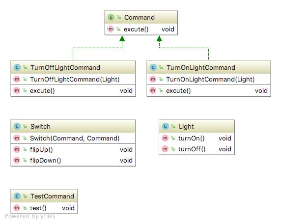

# Command pattern

## What is command pattern?

 - 명령(command), 수신자(reiceiver), 발동자(invoker), 클라이언트(client) 구성.
 - 커맨드 객체는 수신자 객체를 가지고 있다.
 - 수신자의 메서드를 호출하여 수신자는 자신의 메서드를 수행한다.
 - 커맨드 객체는 발동자 객체에 전달되어 명령을 발동하게 된다.
 - 발동자 객체는 필요에 따라 명령 발동에 대한 기록을 남길 수 있다.
 - 한 발동자 객체에 다수의 커맨드 객체가 전달 될 수 있다.
 - 클라이언트 객체는 발동자 객체와 하나 이상의 커맨드 객체를 보유한다.
   
## Class description

 - Command.java : command interface
 - TurnOffLightCommand.java : command object1
 - TurnOnLightCommand.java : command object2
 - Light.java : reiceiver
 - Switch.java : invorker
 - TestCommand.java : client
  
## Class diagram

## References:

[1]https://ko.wikipedia.org/wiki/%EC%BB%A4%EB%A7%A8%EB%93%9C_%ED%8C%A8%ED%84%B4
