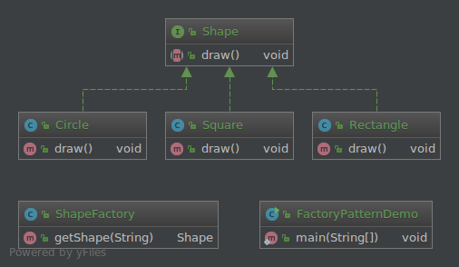

# Factory pattern
팩토리 패턴(Factory pattern)은 클라이언트로 부터 인스턴스를 생성하는 책임을 갖는 패턴이다. 생성자를 호출하는 대신 팩토리 메서드를 호출하여 객체를 생성하도록 한다. 팩토리 메서드는 인터페이스에서 지정되고 하위 클래스로 구현한다.

### 상세설명
 - 추상 팩토리 패턴과 팩토리 메서드 패턴으로 나뉜다.
 - 추상 팩토리 패턴은 팩토리 메서드를 제어하기 위해 사용한다.
 - 따라서 추상 팩토리 패턴은 인터페이스로 지정된다.
 - 팩토리 메서드는 인터페이스를 구현한 것이다.
 - 결과적으로, 생성자를 호출하는 것이 아닌 메서드를 호출함으로써 객체를 생성하는 것이다. 
 - 팩토리 메서드 패턴으로 어떤 문제를 해결할 수 있는가?
   1. 어떻게 서브 클래스가 인스턴스화 할 클래스를 재정의 할 수 있도록 객체를 생성 하는지.
   2. 어떻게 클래스가 인스턴스화를 하위 클래스로 넘길 수 있는지.
 - 팩토리 메서드 패턴은 어떤 솔루션으로 설명되는가?
   1. 객체를 생성하기 위한 별도의 팩토리 메서드를 정의한다.
   2. 팩토리 메서드를 호출할 객체를 만든다.
 - [[1]의존성 뒤집기 법칙(Dependency Inversion Principle)](https://en.wikipedia.org/wiki/Dependency_inversion_principle)을 따른다.  
### 클래스 설명
 - Shape.java : interface
 - Circle.java : object1
 - Rectangle.java : object2
 - Square.java : object3
 - FactoryPatternDemo.java : client
### 다이어그램

### 참조:
[1]https://en.wikipedia.org/wiki/Dependency_inversion_principle

[2]https://en.wikipedia.org/wiki/Factory_method_pattern