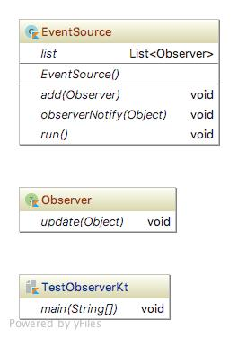

# Observer pattern
옵서버 패턴(observer pattern)은 객체의 상태 변화를 관찰하는 관찰자들, 즉 옵저버들의 목록을 객체에 등록하여 상태 변화가 있을 때마다 메서드 등을 통해 객체가 직접 목록의 각 옵저버에게 통지하도록 하는 디자인 패턴이다.
 
### 상세설명
 - 옵저버(또는 리스너)와 관찰대상(또는 관찰객체, 주체)가 존재한다.
 - 하나 이상의 옵저버 객체를 관찰객체에 등록시킨다.
 - 관찰객체에는 일반적으로 등록(register), 제거(unregister)기능이 존재한다.
 - 관찰객체에 이벤트가 발생하면 옵저버들은 [2][콜백](https://en.wikipedia.org/wiki/Callback_(computer_programming))을 받는다.
 - 발행/구독 모델이라고도 불림.
 - 주로 분산 이벤트 핸들링 시스템 구현에 사용.
 - 순환 실행을 유의하여 구현한다.
   - 예) 이벤트 X가 발생하면 옵저버A가 옵저버B를 갱신한다고 가정한다. 그런데 옵저버B가 이 처리를 위해 옵저버A를 갱신한다면, 이는 다시 A로 하여금 이벤트 X를 발생하게 한다. 이같은 상황을 막기 위해 이벤트 X가 한번 처리된 후에는 A가 이벤트 X를 다시 발생시키지 않는 방법이 요구된다.
   
### 클래스 설명 (Kotlin)
 - EventSource.kt : Obserable object
 - Observer.kt : Obserber object
 - TsstObserver.kt : client
 
### 다이어그램

### 주의사항
 - JDK9 부터 [3][Observalbe](https://docs.oracle.com/javase/9/docs/api/java/util/Observable.html), [4][Observer](https://docs.oracle.com/javase/9/docs/api/java/util/Observer.html)가 없어 짐.
 - 오라클은 기존 객체들을 대신해서 [5][Flow](https://docs.oracle.com/javase/9/docs/api/java/util/concurrent/Flow.html)를 사용하라고 한다. 
 - 오라클은 2018년 9월 이후 Java SE 8의 추가 업데이트를 게시하지 않는다고 공식 발표했다.
 
### 참조:
[1]https://en.wikipedia.org/wiki/Observer_pattern

[2]https://en.wikipedia.org/wiki/Callback_(computer_programming)

[3]https://docs.oracle.com/javase/9/docs/api/java/util/Observable.html

[4]https://docs.oracle.com/javase/9/docs/api/java/util/Observer.html

[5]https://docs.oracle.com/javase/9/docs/api/java/util/concurrent/Flow.html