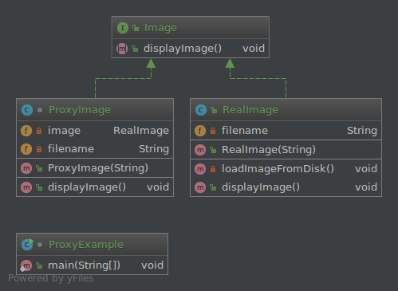

# Proxy pattern
프록시 패턴(Proxy pattern)은 네트워크 연결, 메모리가 큰 개체, 파일 또는 복제 비용이 많이 드는 객체를 백그라운드에서 접근하기 하기 위해 클라이언트가 호출하는 에이전트 객체다.

### 상세설명
 - 데이터를 갖는 객체를 실제 객체(Real object)라 한다.
 - 실제 객체에 접근하여 사용하는 객체를 프록시 객체라 한다.
 - 프록시 객체는 클라이언트의 요청을 실제 객체로 전달하거나, 추가적인 논리를 제공할 수 있다.
 - 실제 객체의 리소스 사용량이 많을 경우 캐싱 또는 사전 조건을 확인하는 등의 추가 기능으로 효율적으로 메모리를 관리할 수 있게 한다. 
 - 프록시 패턴으로 어떤 문제를 해결할 수 있는가?
   1. 객체에 대한 엑세스를 제어한다.
   2. 객체에 액세스 할 때 추가 기능이 제공되어야 한다.
   3. 예를들어 실제 객체에 액세스 할 때 클라이언트가 필요한 액세스 권한을 갖고 있는지 확인할 수 있어야 한다.
 - 프록시 패턴은 어떤 솔루션으로 설명되는가?
   1. 다른 객체의 대체물로 사용할 수 있다.
   2. 액세스를 제어하는 추가 기능을 구현한다.
   3. 이를 통해 프록시 객체를 통해 작업하여 실제 객체에 액세스할 때 추가 기능을 수행할 수 있다.  
### 클래스 설명
 - Image : interface
 - RealImage : Real object
 - ProxyImage : Proxy object
 - ProxyExample : client
 
### 다이어그램

### 참조:
[1]https://en.wikipedia.org/wiki/Proxy_pattern
